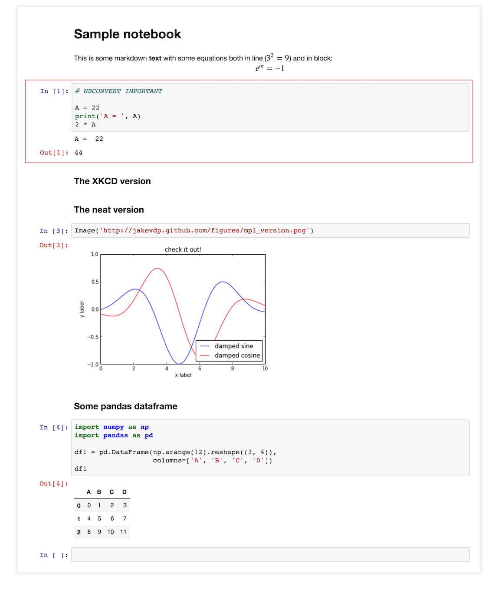
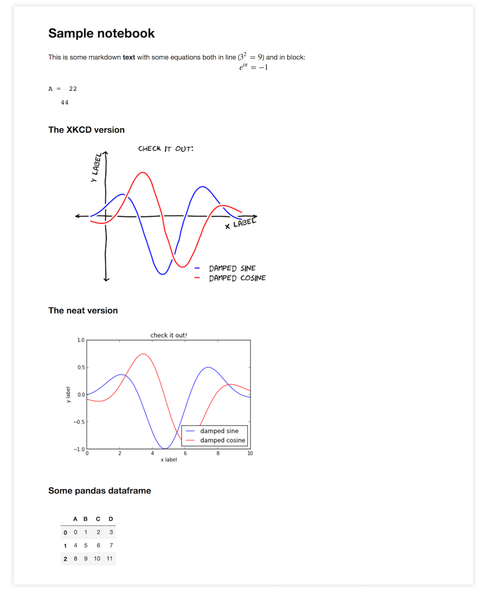

## Custom nbconvert 

### 1 - Purpose

The notebook [nbconvert_notebook](http://nbviewer.jupyter.org/github/oscar6echo/nbconvert-custom/blob/master/nbconvert_notebook.ipynb) converts the [sample_notebook](http://nbviewer.jupyter.org/github/oscar6echo/nbconvert-custom/blob/master/sample_notebook.ipynb) into a static HTML file, after applying custom jinja templates to do these types of operations:
+ Inject the latest notebook CSS - to show dataframe in the new much better looking style.
+ Circle in red cells marked as IMPORTANT (comment at the top of a code cell)
+ Remove cells marked as REMOVE (comment at the top of a code cell)
+ Remove code cells
+ Hide `In[]` and `Out[]`

I really wonder why nbconvert and consequently nbviewer (worse) is not up to date with the notebook CSS. If you use pandas dataframe often, the rendering is disappointing.  

### 2 - Results

*Template: selective*

*Template: hide*

### 3 - To Do

Remove unecessary CSS injection when [nbconvert issue 704](https://github.com/jupyter/nbconvert/issues/704) is solved.  

